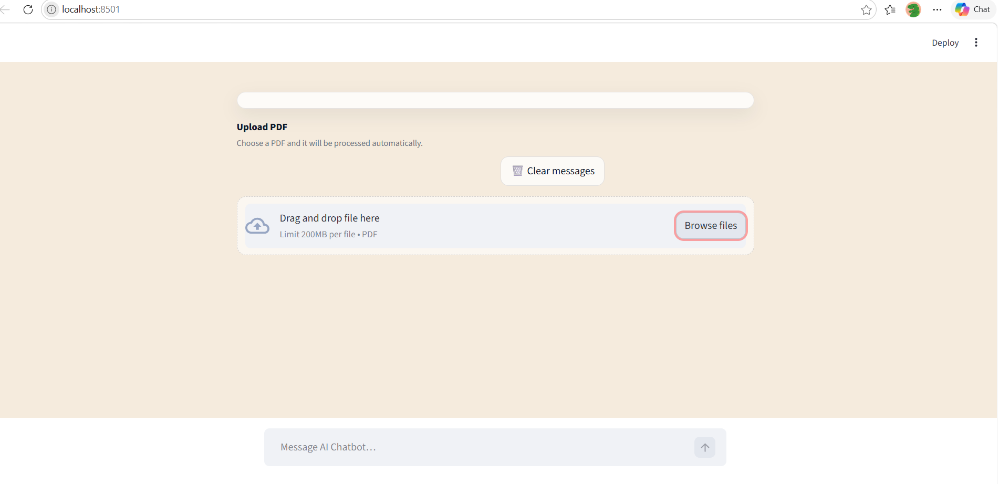
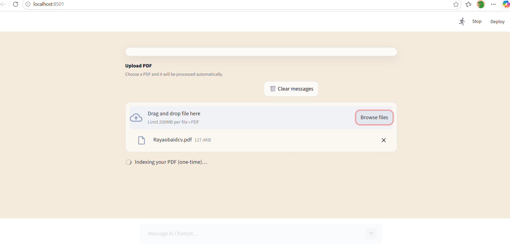
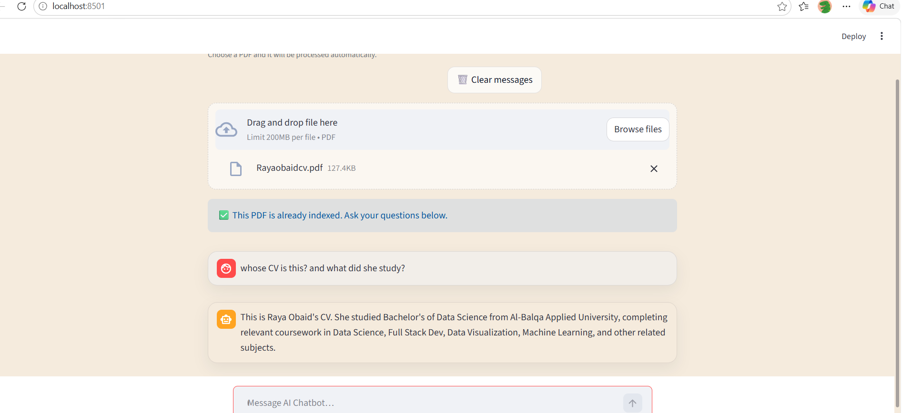

# AI PDF Assistant - Chatbot

An intelligent PDF question-answering system built with FastAPI and Streamlit.

## Features
- Upload any PDF
- Ask natural language questions
- Retrieval-Augmented Generation (RAG)
- Chat-style interface

## Tech Stack
- Python
- FastAPI
- Streamlit
- OpenRouter API
- Scikit-learn

## Architecture

User → Upload PDF → Chunking → Vector Search → GPT → Answer

## Demo

